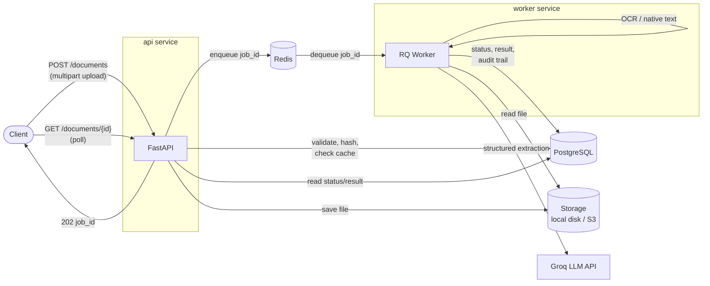

# IntelliExtract

An async, production-style REST API that ingests documents (PDFs/images),
runs them through an OCR + LLM extraction pipeline with automatic
validation and self-correction, and returns structured, confidence-scored
JSON — built the way a real data-extraction platform would be built
(queuing, retries, validation, rate limiting, caching, observability),
not as a script.

Built to mirror the extraction/AI-refinement pipeline work I do at S&P
Global, end-to-end, including the production concerns a demo script
usually skips.

## Architecture



The API never blocks on processing: an upload is validated, hashed, and
queued, then returns `202 Accepted` immediately. A separate worker
process pulls jobs off a Redis queue and does the actual work — text
extraction, LLM calls, validation — updating Postgres as it goes. The
client polls for status/result. This is the same shape as any real
async ingestion pipeline: accept fast, process out-of-band, let the
caller check back.

## Core workflow

1. **Upload** — `POST /api/v1/documents` with a file + `document_type`
   hint (`invoice`, `resume`, `receipt`, `generic`).
2. **Validate & hash** — file type is sniffed from actual magic bytes
   (not the client-supplied `Content-Type`, which costs nothing to
   spoof), size-capped, and SHA-256 hashed.
3. **Cache check** — if a `DONE` job already exists for the same
   `(file_hash, document_type)`, the result is cloned and returned
   immediately (`200`, `cached: true`) — no reprocessing, no LLM cost.
4. **Enqueue** — otherwise, the file is stored (content-addressed key)
   and a job is queued; the API returns `202` with a `job_id`.
5. **Extract** — the worker pulls native PDF text, or falls back to
   Tesseract OCR (rasterize + recognize) when there's no usable text
   layer — a scanned document, or a plain image upload.
6. **AI extraction** — for invoices, the raw text + a JSON schema go to
   Groq (`llama-3.3-70b-versatile`, OpenAI-compatible API) for
   structured extraction.
7. **Validate & self-correct** — the result is checked against business
   rules (line items reconcile with the total, tax/discount/adjustments
   accounted for, date is real and not in the future). A failure
   re-prompts the LLM with the *specific* problem, up to 2 retries. Each
   field gets a confidence score.
8. **Persist** — final result, raw extracted text, confidence scores,
   and a full audit trail (every prompt, every LLM response, every
   validation error) are stored, linked to the job.
9. **Retrieve** — the client polls `GET /documents/{id}` for status, or
   `GET /documents/{id}/audit` for the complete extraction history.
10. **Ask anything** — `POST /documents/{id}/query` runs a fresh,
    ad-hoc LLM call against the document's already-extracted text,
    independent of the fixed invoice schema and of `document_type`.
    Ask for exactly the fields you want (`{"fields": ["vendor_name",
    "due_date"]}`) or omit `fields` entirely and let the model propose
    whatever's relevant — works on invoices, resumes, or anything else.

## API surface

| Method | Path | Purpose |
|---|---|---|
| `POST` | `/api/v1/documents` | Upload a document, returns `job_id` |
| `GET` | `/api/v1/documents/{job_id}` | Get status + result |
| `GET` | `/api/v1/documents/{job_id}/audit` | Full audit trail — raw text, every LLM attempt, validation errors |
| `POST` | `/api/v1/documents/{job_id}/query` | Ask for specific (or open-ended) fields from any already-processed document |
| `GET` | `/api/v1/documents` | List jobs for the caller's key (paginated) |
| `POST` | `/api/v1/auth/keys` | Issue an API key (admin-only, `X-Admin-Key`) |
| `GET` | `/healthz` | Liveness check |
| `GET` | `/metrics` | Prometheus-format metrics |

Every response follows a consistent envelope; every error uses a
consistent `{"error": {"code": ..., "message": ...}}` shape with a
machine-readable code. The API is versioned (`/api/v1/...`) from day
one. Full interactive docs with request/response examples: `/docs`
(Swagger UI) once the stack is running.

## Getting started

```bash
git clone https://github.com/vishesh0306/intelliextract.git
cd intelliextract
cp .env.example .env   # fill in GROQ_API_KEY at minimum (see below)
docker compose up -d --build
```

That's it — one command. Postgres and Redis health-checks gate the
`api`/`worker` services, and `api` runs `alembic upgrade head`
automatically before starting, so a completely fresh clone ends up with
a fully migrated schema and no manual steps.

```bash
curl http://localhost:8000/healthz
# {"status":"ok"}
```

You'll need a **free Groq API key** (console.groq.com → API Keys) for
the AI extraction stage to work — put it in `.env` as `GROQ_API_KEY`.
Without it, uploads still work and text still gets extracted; only the
invoice structured-extraction stage will fail.

To issue yourself an API key:

```bash
# Option A: the admin endpoint (needs ADMIN_API_KEY set in .env)
curl -X POST http://localhost:8000/api/v1/auth/keys \
  -H "X-Admin-Key: $ADMIN_API_KEY" \
  -H "Content-Type: application/json" \
  -d '{"owner_name": "me", "rate_limit_per_min": 30}'

# Option B: the bootstrap script (works even without ADMIN_API_KEY set)
uv run python -m scripts.create_api_key --owner me --rate-limit 30
```

Then upload a document:

```bash
curl -X POST http://localhost:8000/api/v1/documents \
  -H "X-API-Key: <your key>" \
  -F "file=@invoice.pdf;type=application/pdf" \
  -F "document_type=invoice"
# {"job_id": "...", "status": "PENDING", "cached": false}

curl http://localhost:8000/api/v1/documents/<job_id> \
  -H "X-API-Key: <your key>"
```

Or use Swagger UI at `http://localhost:8000/docs` — click "Try it out"
on `POST /api/v1/documents`, no curl needed.

### Running tests

```bash
uv run pytest -v                                    # 71 tests, ~10s
uv run pytest --cov=app --cov-report=term-missing    # coverage report
```

Tests run against the real Postgres/Redis from `docker compose up`
(not mocks) but always mock the LLM client — no test ever calls the
real Groq API, so the suite is deterministic and free to run in CI.

## Design write-ups

### The self-correction retry loop

`app/services/self_correction.py` is the centerpiece: the LLM gets one
shot at structured extraction, the result is checked against business
rules (`app/services/validation.py`) — do the line items sum to the
total once tax/discount/adjustments are factored in, is the date real
and not in the future — and if it fails, the model gets re-prompted
with the *specific* error message ("line item amounts sum to X but
total is Y") rather than just being asked to try again blind. This
repeats up to 3 attempts total (1 initial + 2 retries, per spec). If it
never passes, the job lands on `NEEDS_REVIEW` — not `FAILED`, which is
reserved for actual infrastructure problems (unreadable file, LLM API
down) — and still carries the model's best-effort parsed fields, so a
human reviewing it sees the closest attempt, not nothing. Every attempt
(prompt, raw response, validation errors) is persisted regardless of
outcome, giving a complete, replayable audit trail.

Confidence scores are a deliberate heuristic, not real per-token
probabilities: Groq's JSON-mode structured output doesn't reliably
expose logprobs mappable back to individual fields, and the spec
explicitly sanctions this fallback. A field's score reflects how much
correction the whole extraction needed — fewer attempts and never being
named in a validation error means higher confidence — rather than the
model's internal certainty.

### Rate limiting

`app/services/rate_limiter.py` implements a token-bucket limiter
entirely in Redis, evaluated atomically via a single Lua script
(`EVAL`). This matters: a naive implementation using separate
`GET`-then-`SET`/`INCR` calls from Python has a race window where two
concurrent requests can both read the same token count and both spend
a token, over-admitting by one every time they overlap under load. The
Lua script runs the whole read-refill-check-decrement sequence as one
atomic operation on the Redis server, so concurrent requests against
the same API key genuinely can't race past each other. Each key gets
its own bucket (capacity = its configured `rate_limit_per_min`, refill
rate = capacity/60 tokens per second), and an exceeded limit returns
`429` with a `Retry-After` header computed from how long until the next
token is available — confirmed under real concurrent load in
[benchmarks.md](benchmarks.md) (exactly 5 requests through, 3 rejected,
every run, for a key capped at 5/min).

### Caching

Storage keys are content-addressed (the SHA-256 hash of the file, not
the original filename), which means the caching check — "has this
exact file been processed before, for this document type?" — and the
storage layer share the same key for free. A cache hit clones a *new*
job row owned by the requesting API key (copying the cached
`extracted_json`/`confidence_scores`/`raw_text`) rather than handing
back the original `job_id`, because `GET /documents/{id}` is
ownership-scoped to the requesting key, and the original job might
belong to someone else. The clone skips storage entirely (the file's
already sitting at that content-addressed path) and never touches the
queue or the LLM.

### Ad-hoc document queries

The invoice pipeline (fixed `InvoiceFields` schema, business-rule
validation, self-correction retries) stays exactly as-is for
`document_type=invoice`, because it has something worth validating —
do the numbers reconcile. But real usage doesn't stop at one schema:
sometimes you just want "what's the vendor's GSTIN" or "what does this
resume say about their education," on a document that was never going
to fit a rigid Pydantic model. `POST /documents/{id}/query`
(`app/services/generic_extraction.py`) runs a single LLM call against
the job's already-extracted text — no re-OCR, no dependency on
`document_type` — with either an exact field list (the response keys
echo the requested names verbatim) or, if none is given, whatever
key-value structure the model judges relevant to that specific
document. There's no business-rule validation here — there's no
generalizable "does this reconcile" check for an arbitrary field on an
arbitrary document — but there is one lightweight retry if the model's
response isn't valid JSON, and every call is still recorded in the
job's audit trail (`stage: CUSTOM_QUERY`) alongside the original
extraction attempts.

### Observability

Structured JSON logging via `structlog`, integrated with stdlib
logging so third-party logs (uvicorn, RQ, SQLAlchemy, httpx) come out
in the same JSON shape as the app's own log calls — one consistent log
stream, not two. A `request_id` is bound to every API log line;
`job_id` is bound wherever a specific job is involved, in *both* the
API process and the worker process, which is what makes a job's full
lifecycle traceable end-to-end with a single `grep`. `GET /metrics`
exposes job counts by status, average processing time, and cache hit
ratio in Prometheus text format.

## Benchmarks

Real, measured numbers (not estimates) — see
[benchmarks.md](benchmarks.md) for the full methodology and reasoning.
Headline results:

- **Cache hit: ~4.6s → ~70ms (~65x faster), zero LLM cost.**
- Upload acceptance (`202`) stays under ~150ms regardless of
  concurrency — proves the queue actually decouples "accept the
  request" from "do the work."
- 5 concurrent new invoices took ~19.6s total (~5x the ~3.9s single-job
  time) because one worker replica processes serially, while 20
  concurrent cache-hit requests did ~23 req/s on the same hardware —
  the clearest evidence that the API and worker scale independently
  (see Scaling below).
- Rate limiting held exactly at 5/min under real concurrent load, every
  run, with a correct `Retry-After` header.

## Test coverage

**93% overall** (`uv run pytest --cov=app`), with the extraction and
validation logic the spec calls out specifically — `app/services/
extraction.py` and `app/services/validation.py` — at **100%**. CI
enforces a 70% floor (`--cov-fail-under=70`).

The honest gaps: `app/storage/s3.py` (0% — never exercised without real
AWS credentials; the local backend is what's actually tested and used
in dev/CI) and `app/worker/main.py` (0% — a process entrypoint, verified
manually via Docker rather than unit-tested, since "does calling
`worker.work()` block forever listening on a queue" isn't meaningfully
unit-testable). Both are architecturally simple enough that the risk of
leaving them uncovered is low relative to the cost of mocking boto3 or
faking an RQ event loop just to hit a coverage number.

## Scaling story

No horizontal autoscaling is set up (out of scope for v1 — see
`PROJECT_SPEC.md`), but the architecture is already shaped for it:

- **The worker is the bottleneck, and it scales independently of the
  API.** `docker compose up --scale worker=N` (or N tasks in an ECS
  service, N pods in Kubernetes) would let real-processing throughput
  approach the cache-hit ceiling (~23 req/s measured) without touching
  the API layer, because the API and worker only communicate through
  Redis — neither knows how many instances of the other exist.
- **The API is stateless** (all state lives in Postgres/Redis), so it
  scales horizontally behind a load balancer with no coordination
  needed between replicas.
- **Storage already has an S3 interface** (`app/storage/s3.py`, chosen
  via `STORAGE_BACKEND=s3`), so moving off local disk for a multi-
  instance deployment is a config change, not a code change.
- **A real deployment** would put Postgres on RDS, Redis on
  ElastiCache, and the `api`/`worker` images (already built by the same
  Dockerfile used locally) on ECS Fargate as two separate services with
  independent scaling policies — `api` scaled on request rate/CPU,
  `worker` scaled on Redis queue depth. No code changes required to get
  there; only infrastructure and environment variables.

## Tech stack

FastAPI (async) · PostgreSQL + SQLAlchemy (async) + Alembic · Redis +
RQ · PyMuPDF + Tesseract OCR · Groq (OpenAI-compatible SDK) · Pydantic
v2 · structlog · pytest + httpx + pytest-cov · Docker Compose · GitHub
Actions CI · uv

## License

MIT — see [LICENSE](LICENSE).
